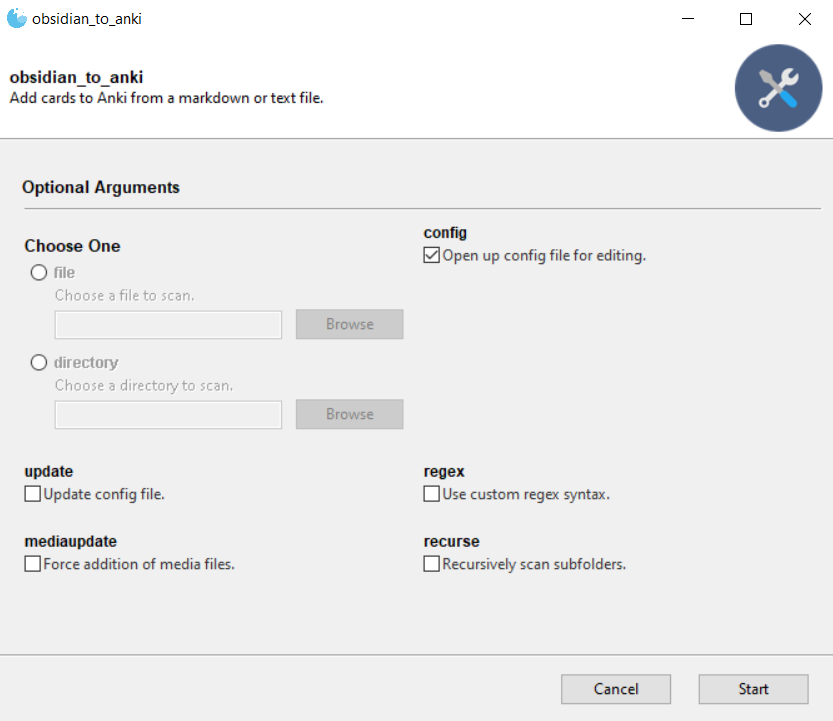

**Regex line:** `((?:.+\n)*(?:.*(?:(?<!\\)(?<!\\\w{1})(?<!\\\w{2})(?<!\\\w{3})(?<!\\\w{4})(?<!\\\w{5})(?<!\\\w{6})(?<!\\\w{7})(?<!\\\w{8})(?<!\\\w{9})(?<!\\\w{10})(?<!\\\w{11})(?<!\\\w{12})(?<!\\\w{13})(?<!\\\w{14})(?<!\\\w{15})(?<!\\\w{16})(?<!\\\w{17})(?<!\\\w{18})(?<!\\\w{19})(?<!\\\w{20})(?<!\])(?<!\$)(?<!}){).*\n?)(?:.+\n)*)`

**Example usage:**
1. Create a file called `test.md`.
2. Paste the following contents into the file:
<pre>
The idea of {cloze paragraph style} is to be able to recognise any paragraphs that contain {cloze deletions}.

The script should ignore paragraphs that have math formatting like $\frac{3}{4}$ but no actual cloze deletions.

With {2:CurlyCloze} enabled, you can also use the {c1|easier cloze formatting},
but of course {{c3::Anki}}'s formatting is always an option.
</pre>
3. Run the script, and check 'Config' to open up the config file:  

4. Navigate to the "Custom Regexps" section
5. Change the line
<pre>
Cloze =  
</pre>  
to  
`Cloze = ((?:.+\n)*(?:.*(?:(?<!\\)(?<!\\\w{1})(?<!\\\w{2})(?<!\\\w{3})(?<!\\\w{4})(?<!\\\w{5})(?<!\\\w{6})(?<!\\\w{7})(?<!\\\w{8})(?<!\\\w{9})(?<!\\\w{10})(?<!\\\w{11})(?<!\\\w{12})(?<!\\\w{13})(?<!\\\w{14})(?<!\\\w{15})(?<!\\\w{16})(?<!\\\w{17})(?<!\\\w{18})(?<!\\\w{19})(?<!\\\w{20})(?<!\])(?<!\$)(?<!}){).*\n?)(?:.+\n)*)`  

6. Also set `CurlyCloze = True` to have the above example work properly.
7. Save the config file
8. Run the script on the file, with 'Regex' checked:  

9. You should see these cards in Anki:  
  
