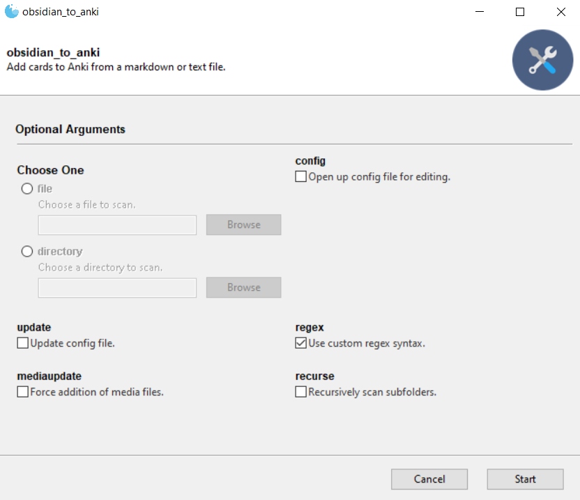

# Usage
**[[Regex]] line:** `^#+(.+)\n*((?:\n(?:^[^\n#].{0,2}$|^[^\n#].{3}(?<!<!--).*))+)`

1. Create a file called `test.md`
2. Paste the following contents into the file:

<pre>
# Style  
This style is suitable for having the header as the front, and the answer as the back
# Overall heading
## Subheading 1
You're allowed to nest headers within each other
## Subheading 2
It'll take the deepest level for the question
## Subheading 3
   
   
   
It'll even
Span over
Multiple lines, and ignore preceding whitespace
</pre>
## Obsidian Plugin users
3. In the plugin settings, paste the Regex line into the 'Custom Regexps' field associated with 'Basic'
4. Ensure that the 'Regex' option is checked
5. Click the Anki icon on the ribbon to run the plugin

## Python script users
3. Run the script, and check 'Config' to open up the config file:  

4. Navigate to the "Custom Regexps" section
5. Change the line
<pre>
Basic =
</pre>
to  
<pre>
Basic = ^#+(.+)\n+((?:[^\n#][\n]?)+)
</pre>
6. Save the config file
7. Run the script on the file, with 'Regex' checked:  

## All users
8. You should see these cards in Anki:  
  
  
  
  

### Subheader paragraph style

If you'd like the effect of the header paragraph style, but only want it to add cards below a certain subheading level (e.g. 3 # or more), use the following regex:

* 2 or more - `^#{2,}(.+)\n+((?:[^\n#][\n]?)+)`
* 3 or more - `^#{3,}(.+)\n+((?:[^\n#][\n]?)+)`
* n or more - `^#{n,}(.+)\n+((?:[^\n#][\n]?)+)`, where you replace `{n,}` with the value of the number n. E.g. if n was 4, it would read `^#{4,}(.+)\n+((?:[^\n#][\n]?)+)`