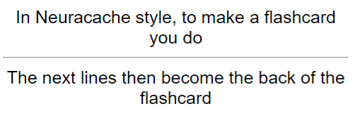
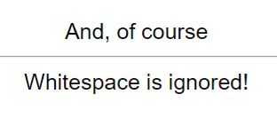

**[[Regex]] line:** `((?:[^\n][\n]?)+) #flashcard\n+((?:[^\n][\n]?)+)`

**Example usage:**
1. Create a file called `test.md`
2. Paste the following contents into the file:

<pre>
In Neuracache style, to make a flashcard you do #flashcard
The next lines then become the back of the flashcard

If you want, it's certainly possible to
do a multi-line question #flashcard
You just need to make sure both
the question and answer are one paragraph.

And, of course #flashcard

Whitespace is ignored!

</pre>
3. Run the script, and check 'Config' to open up the config file:  

4. Navigate to the "Custom Regexps" section
5. Change the line
<pre>
Basic =
</pre>
to  
<pre>
Basic = ((?:[^\n][\n]?)+) #flashcard\n+((?:[^\n][\n]?)+)
</pre>
6. Save the config file
7. Run the script on the file, with 'Regex' checked:  

8. You should see these cards in Anki:  
  
  
  