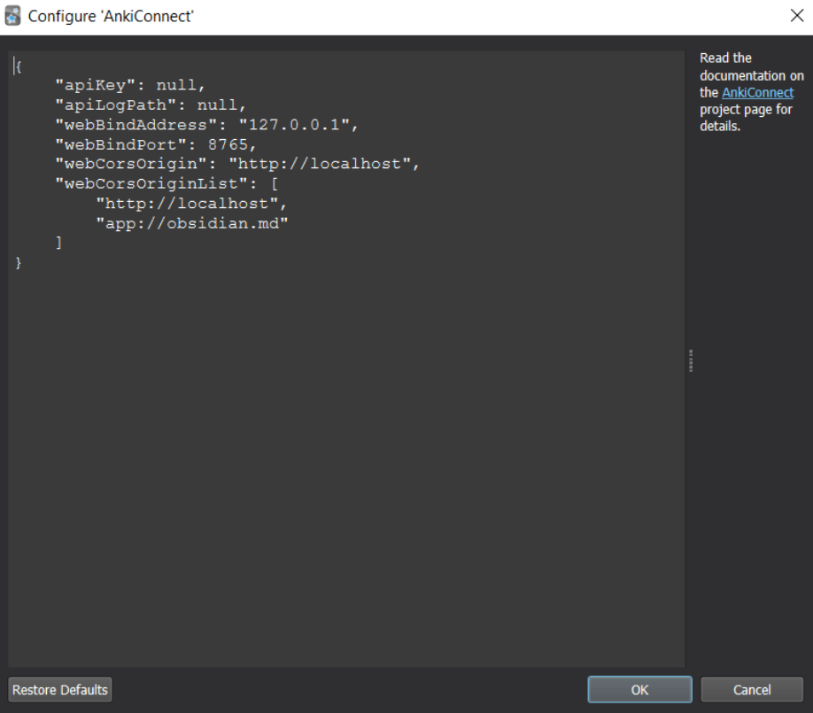

### All users
1. Install the latest version of [Python](https://www.python.org/downloads/).
2. Start up [Anki](https://apps.ankiweb.net/), and navigate to your desired profile.
3. Ensure that you've installed [AnkiConnect](https://github.com/FooSoft/anki-connect).

### Obsidian plugin users
4. Have [Obsidian](https://obsidian.md/) downloaded
5. Search the 'Community plugins' list for this plugin
6. Install the plugin.
7. In Anki, navigate to Tools->Addons->AnkiConnect->Config, and change it to look like this: 
8. With Anki running in the background, load the plugin. This will generate the plugin settings.

You shouldn't need Anki running to load Obsidian in the future, though of course you will need it for using the plugin!

### Python script users
4. If you are a new user, download `obstoanki_setup.py` from the [releases page](https://github.com/Pseudonium/Obsidian_to_Anki/releases), and place it in the folder you want the script installed (for example your notes folder).  
5. Run `obstoanki_setup.py`, for example by double-clicking it in a file explorer. This will download the latest version of the script and required dependencies automatically. Existing users should be able to run their existing `obstoanki_setup.py` to get the latest version of the script.  
6. Check the Permissions tab below to ensure the script is able to run.
7. Run `obsidian_to_anki.py`, for example by double-clicking it in a file explorer. This will generate a config file, `obsidian_to_anki_config.ini`.

#### Permissions
The script needs to be able to:
* Make a config file in the directory the script is installed.
* Read the file in the directory the script is used.
* Make a backup file in the directory the script is used.
* Rename files in the directory the script is used.
* Remove a backup file in the directory the script is used.
* Change the current working directory temporarily (so that local image paths are resolved correctly).